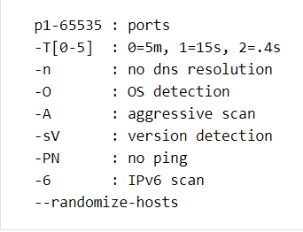
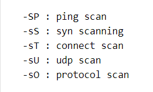
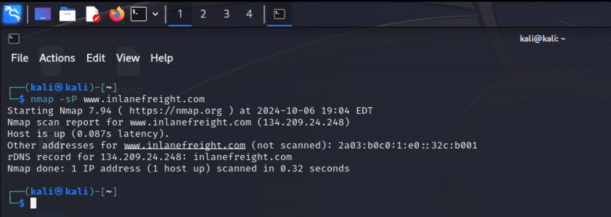

## KALI TOOL - NMAP
Category: Network Mapping / Active Reconaissance

## Purpose
1. Powerful tool for finding open ports, examining hosts, and extracting useful information about port services
2. Free and open source utility for network exploration, obtaining network inventory documents, and other information about organizational infrastructure
3. Operates using raw IP packets
4. Features Include: ping sweep, scan and show open ports, determine open services, discovering and listing hosts, service version discovery, and more active reconnaissance features 

## Location
Application -> 02-Vulnerability Analysis -> nmap

## Install Guide
sudo apt-get update

sudo apt-get install nmap

## Options and Scan Types

## Options and Scan Types
Command Syntax: nmap -option IP address

## Examples of nmap usage
Scan and show open ports: nmap --open ‘IP address’
Determine open services: nmap -sV ‘IP address’

Ping Scan: nmap -sP ‘IP address/port #’

Scan HTTPS and HTTP Port: nmap -p 443,80 ‘IP address’

** Click on nmap application on Kali Desktop to see all options and services along with command syntax

